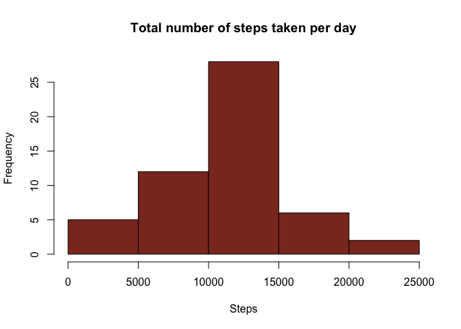
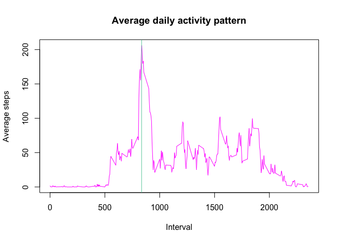
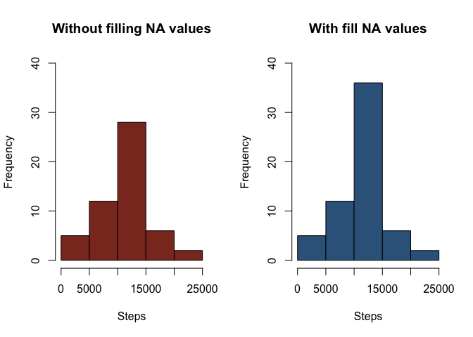
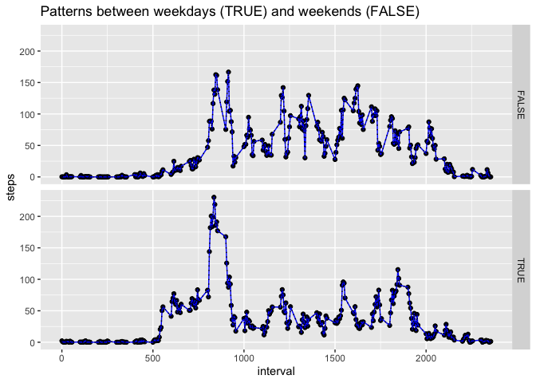

## Loading and preprocessing the data

```r
data<-read.csv(unz("activity.zip", "activity.csv"))
```

## What is mean total number of steps taken per day?

Calculate the total number of steps taken per day (ignoring the missing values in the dataset.)

```r
totals<-with(data,tapply(steps,as.factor(date),sum))
```

Plotting histogram

```r
hist(totals, main = "Total number of steps taken per day", xlab = "Steps",
     col="tomato4")
```

<!-- -->

```r
#calculating mean and median
medianSteps <- format(median(totals,na.rm = T),scientific=FALSE)
meanSteps <- format(mean(totals,na.rm = T),scientific=FALSE)
```

The total number of steps taken per day has the following values **mean = 10766.19** and **median = 10765**

## What is the average daily activity pattern?

The pattern can be seen in the next plot.


```r
stepsInterval <- aggregate(steps ~ interval, data, mean)

with(stepsInterval,plot(interval, steps, type='l', col="magenta", 
     xlab="Interval", 
     ylab="Average steps",
     main="Average daily activity pattern"
     ))

maxInterval<-stepsInterval$interval[[which.max(stepsInterval$steps)]]

abline(v=maxInterval, col="aquamarine3")
```

<!-- -->

The 5-minute interval, on average across all the days in the dataset, that contains the maximum number of steps is **835** and can be seen in the graph with the vertical aquamarine line.

## Imputing missing values

Note that there are a number of days/intervals where there are missing values (coded as NA). The presence of missing days may introduce bias into some calculations or summaries of the data.  


```r
noNAs <- data[complete.cases(data),]

totalIncompleteCases = dim(data)[1]-dim(noNAs)[1]
```

In this case, the total number of rows with NAs is **2304** 

In order to take out this NA values, we are going to replace them by the average of steps by interval.


```r
#separating NAs from no NAs
noStepsNA <- data[!is.na(data$steps),]
stepsNA <- data[is.na(data$steps),]

#filling missing data
averages <- tapply(noStepsNA$steps,noStepsNA$interval, mean)
stepsNA$steps <- averages

#creating new dataset
filled <- rbind(noStepsNA,stepsNA)
```

Having this new dataset, we can create again the histogram of the total number of steps taken each day and calculate and report the mean and median total number of steps taken per day.


```r
totalsNew<-with(filled,tapply(steps,as.factor(date),sum))
```

Plotting both histograms side to side

```r
par(mfrow=c(1,2))
hist(totals, main = "Without filling NA values", xlab = "Steps",
     col="tomato4", ylim = c(0,40))
hist(totalsNew, main = "With fill NA values", 
     xlab = "Steps",col="steelblue4", ylim = c(0,40))
```

<!-- -->

As we can see, there are subtle differences between both histograms but there are differences that can be seen mainly in the center bar.


```r
#calculating mean and median
medianStepsNew <- format(median(totalsNew,na.rm = T),scientific=FALSE)
meanStepsNew <- format(mean(totalsNew,na.rm = T),scientific=FALSE)

original<-c(meanSteps,medianSteps)
changed<-c(meanStepsNew,medianStepsNew)

compared <- data.frame(original,changed)
names(compared)<-c("Mean","Median")
row.names(compared)<-c("Original","Changed")
```

In the following table, we can see the difference between the mean and the median of both datasets. The only change is over the mean.


```r
compared
```

```
##              Mean   Median
## Original 10766.19 10766.19
## Changed     10765 10766.19
```

## Are there differences in activity patterns between weekdays and weekends?


```r
#Changing date format from Text to Date
filled$date <- strptime(filled$date,format = "%Y-%m-%d")

#creating new variable with the weekday
filled$weekday<-weekdays(filled$date)

#creating factor is weekday day or weekend day
filled$isWeekday<-as.factor(filled$weekday %in% c("Monday","Tuesday","Wednesday","Thursday","Friday"))

weekDays <- filled[filled$isWeekday==TRUE,]
weekendDays <- filled[filled$isWeekday==FALSE,]

library(ggplot2)
meansFilled <- aggregate(steps~ interval+isWeekday, filled, mean)
g <- qplot(interval, steps, data = meansFilled, facets = isWeekday~.)
g<-g + geom_line(col="blue")
g<-g + geom_line(linetype=3)
g<-g + ggtitle("Patterns between weekdays (TRUE) and weekends (FALSE)")
g
```

<!-- -->

As we can see, the main difference is in the amplitude. In weekend days, values are lower.
